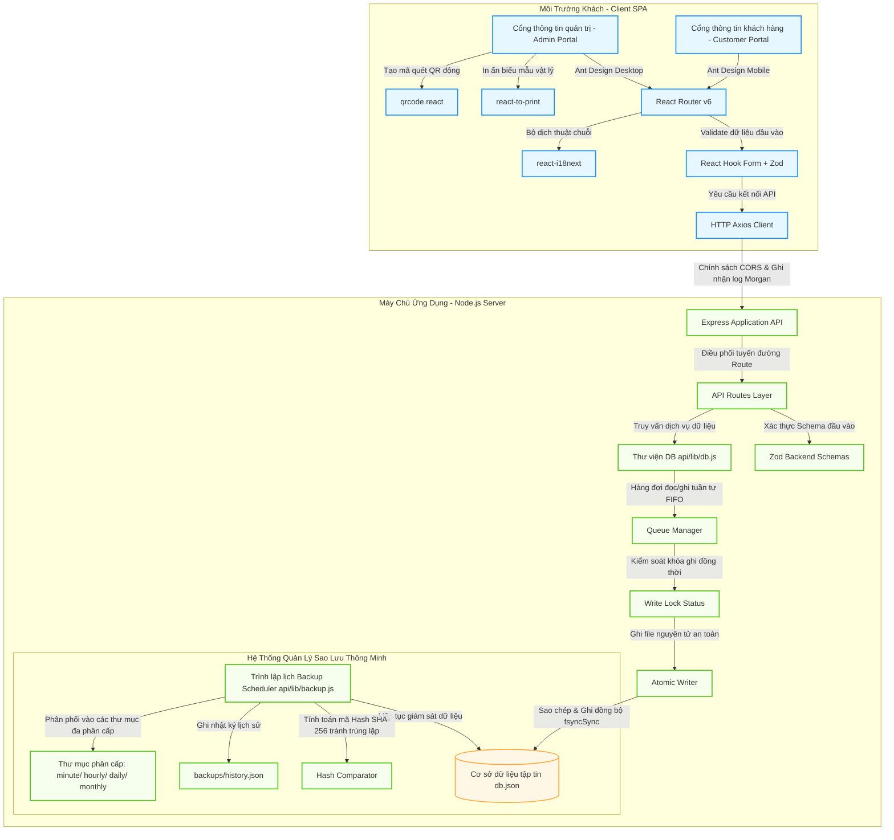

# Hệ Thống Quản Lý Bảo Hành NTPC (NTPC Warranty)
## Đánh Giá Chi Tiết Kiến Trúc Kỹ Thuật & Lộ Trình Nâng Cấp Hệ Thống

Tài liệu này cung cấp một bản phân tích, đánh giá chuyên sâu và chi tiết về mặt kỹ thuật đối với hệ thống quản lý bảo hành **NTPC Warranty (Nguyễn Tân PC)** hiện tại. Phân tích bao gồm chi tiết kiến trúc kỹ thuật hiện tại, sơ đồ hoạt động, đánh giá khách quan về điểm mạnh, điểm yếu, các phương án khắc phục ngắn hạn và lộ trình chuyển đổi sang kiến trúc Enterprise dài hạn tối ưu nhất.

---

## 1. Tổng Quan Nghiệp Vụ Dự Án (Project Overview)

Hệ thống quản lý bảo hành **NTPC Warranty** là giải pháp phần mềm toàn diện nhằm tối ưu hóa quy trình tiếp nhận, xử lý sửa chữa, đổi trả thiết bị công nghệ và quản lý vòng đời bảo hành sản phẩm. Dự án phục vụ hai nhóm đối tượng người dùng chính:

*   **Nhân viên & Ban quản trị (Admin Portal):** Quản lý, theo dõi trạng thái tiếp nhận bảo hành, thực hiện các hành động chuyên sâu như cập nhật tiến độ kỹ thuật, đổi mới/trả hàng cho khách, gửi thiết bị bảo hành tới các đối tác nhà cung cấp (Suppliers), xem báo cáo thống kê hiệu suất, xuất/nhập excel và quản lý cấu hình hệ thống.
*   **Khách hàng (Customer Portal):** Giao diện tra cứu công khai tối giản, thân thiện trên nền tảng di động (Mobile-friendly) giúp khách hàng dễ dàng nhập mã chứng từ hoặc quét QR code để theo dõi tiến độ sửa chữa thiết bị theo thời gian thực (Real-time) mà không cần đăng nhập.

---

## 2. Chi Tiết Kiến Trúc Kỹ Thuật Hiện Tại (Current Technical Stack)

Mã nguồn dự án được xây dựng dưới dạng cấu trúc chia tách rõ ràng giữa lớp xử lý hiển thị giao diện (Frontend SPA) và dịch vụ cung cấp dữ liệu (Backend API) được tích hợp trong cùng một kho lưu trữ mã nguồn để tối ưu hóa quy trình phân phối và triển khai.

### 2.1. Phân Tích Lớp Frontend (Client-side)
*   **Công nghệ cốt lõi:** React (v18.3.0) kết hợp công cụ đóng gói Vite (v5.4.0) nhằm tối đa hóa tốc độ biên dịch (HMR - Hot Module Replacement) và tối ưu dung lượng gói build sản phẩm đầu ra.
*   **Hệ thống thiết kế UX/UI (Design System):**
    *   **Desktop Admin:** Sử dụng thư viện thành phần doanh nghiệp **Ant Design (antd v5.22.2)** đem lại giao diện trang nhã, chuyên nghiệp với cấu trúc bảng thông tin, bộ lọc đa năng và biểu đồ thống kê hiện đại từ `@ant-design/charts`.
    *   **Mobile Customer:** Sử dụng **Ant Design Mobile (v5.42.3)**, tối ưu hoàn hảo cho các thiết bị di động, đảm bảo trải nghiệm vuốt chạm, hiệu ứng mượt mà và hiển thị thông tin trực quan.
*   **Quản lý Form & Ràng buộc dữ liệu (Validation):** Sử dụng **React Hook Form (v7.53.0)** kết hợp giải pháp xác thực schema **Zod (v3.23.0)** thông qua bộ chuyển đổi `@hookform/resolvers`. Ràng buộc dữ liệu chặt chẽ ngay từ giao diện trước khi gửi yêu cầu API.
*   **Kiến trúc Đa ngôn ngữ (i18n):** Tích hợp sâu thư viện **react-i18next** tách biệt hoàn toàn chuỗi văn bản hiển thị ra khỏi logic điều hướng cấu phần giao diện. Toàn bộ ngôn ngữ hiển thị gốc nằm trong các tệp JSON có cấu trúc tại lớp tài nguyên ngôn ngữ (`src/i18n/locales/vi/`).
*   **Các tính năng chuyên dụng hỗ trợ thiết bị ngoại vi:**
    *   **In ấn hóa đơn nhiệt:** Thư viện `react-to-print` hỗ trợ thiết kế biểu mẫu in hóa đơn nhiệt tiêu chuẩn (khổ 80mm), tự động định dạng CSS cho máy in nhiệt tại cửa hàng.
    *   **Tích hợp QR Code / Barcode:** Thư viện `qrcode.react` tạo động mã QR cho từng phiếu biên nhận bảo hành để dán lên vỏ máy của khách hoặc in kèm phiếu nhận máy, giúp tối ưu hóa việc quản lý thiết bị vật lý bằng đầu đọc mã vạch chuyên dụng.

### 2.2. Phân Tích Lớp Backend (Server-side)
*   **Dịch vụ API:** Xây dựng trên nền tảng **Node.js Express (v4.21.0)** sử dụng cơ chế nạp module theo chuẩn hiện đại ES Modules (`"type": "module"`).
*   **Cơ sở dữ liệu cục bộ (File-based JSON DB):** Hệ thống lưu trữ dữ liệu tập trung hoàn toàn trong tệp JSON (`api/db.json`). Nhằm giải quyết điểm nghẽn ghi đồng thời và xung đột ghi file của Node.js, hệ thống triển khai cơ chế **Lock & Queue** an toàn tại `api/lib/db.js`:
    1.  **Read/Write Queue:** Mọi yêu cầu đọc/ghi dữ liệu được đưa vào hàng đợi (`readQueue` và `writeQueue`) để thực hiện tuần tự.
    2.  **Cơ chế Ghi File Nguyên Tử (Atomic Writes):**
        *   Tạo bản sao dự phòng tức thời: Sao chép tệp `db.json` hiện tại thành `db.json.prev` để phục hồi nếu xảy ra lỗi ghi đột ngột.
        *   Ghi tệp tạm thời: Chuẩn bị nội dung mới và ghi vào `db.json.tmp`.
        *   Đồng bộ vật lý xuống ổ cứng: Gọi `fs.fsyncSync` ép hệ thống ghi trực tiếp xuống thiết bị lưu trữ vật lý thay vì lưu trữ ở vùng đệm RAM (Buffer).
        *   Hoàn tất thay thế: Đổi tên (Rename) tệp tạm thành `db.json` chính thức. Cơ chế này đảm bảo dữ liệu không bao giờ bị hỏng (corrupt) ngay cả khi mất điện đột ngột trong quá trình ghi.

### 2.3. Hệ Thống Sao Lưu Siêu Việt (Tiered Backup Scheduler)
Điểm sáng kỹ thuật cực kỳ nổi bật của dự án nằm ở mô-đun quản lý và lập lịch sao lưu tại `api/lib/backup.js`. Thay vì sao lưu đơn giản, hệ thống tích hợp các logic an toàn cấp độ cao:
*   **Chiến lược lưu giữ đa tầng (Multi-tier Retention):** Lập lịch sao lưu tự động với thời gian lưu trữ thông minh:
    *   *Phút (Minute):* Lưu 360 bản ghi, tự dọn dẹp sau 6 giờ.
    *   *Giờ (Hourly):* Lưu 168 bản ghi, tự dọn dẹp sau 7 ngày.
    *   *Ngày (Daily):* Lưu 365 bản ghi, tự dọn dẹp sau 1 năm.
    *   *Tháng (Monthly):* Lưu 60 bản ghi, tự dọn dẹp sau 5 năm.
    *   *Sao lưu thủ công (Manual)* & *Sao lưu an toàn hệ thống khi khôi phục (Restore-safety).*
*   **Tránh trùng lặp dữ liệu thông qua mã hóa SHA-256:** Hệ thống liên tục kiểm tra mã Hash SHA-256 của cơ sở dữ liệu. Nếu trạng thái dữ liệu không thay đổi so với phút trước đó, bản sao lưu phút sẽ tự động bỏ qua để tránh gây phình dung lượng ổ đĩa.
*   **Cơ chế Xác thực cấu trúc Dữ liệu (Shape Validation):** Khi thực hiện khôi phục dữ liệu hoặc nhập tệp dữ liệu tải lên, hàm `validateDbShape` sẽ xác thực tính hợp lệ của lược đồ JSON, đảm bảo không có trường dữ liệu lỗi hoặc thiếu mảng thiết yếu.

---

## 3. Sơ Đồ Kiến Trúc Hệ Thống (System Architecture Diagram)

Sơ đồ dưới đây mô tả luồng giao tiếp dữ liệu từ giao diện ứng dụng phía Client thông qua lớp API Bảo mật xuống Hệ thống lưu trữ và cơ chế sao lưu tại Server:



---

## 4. Đánh Giá Điểm Mạnh Hệ Thống (Detailed Strengths)

Hệ thống quản lý bảo hành NTPC sở hữu nhiều điểm cộng đắt giá phản ánh tư duy thiết kế phần mềm thực tế, bền bỉ và tập trung sâu vào nghiệp vụ thực tế của cửa hàng:

1.  **Thiết kế UX/UI xuất sắc và đồng bộ:** Sự kết hợp đồng thời giữa Ant Design và Ant Design Mobile trên cùng một nền tảng tạo ra hai luồng trải nghiệm hoàn hảo cho cả thiết bị máy tính và điện thoại. Trực quan hóa quy trình bảo hành thành chuỗi trạng thái trực quan tăng độ tin cậy của khách hàng đối với thương hiệu cửa hàng.
2.  **Khả năng đồng bộ hóa giao dịch ghi an toàn (Atomic File Transactions):** Đối với các ứng dụng nhỏ chạy trên tệp dữ liệu JSON, rủi ro lớn nhất là lỗi hỏng file (corrupt) khi ghi. Hệ thống đã giải quyết triệt để lỗi này bằng giải pháp **Atomic Write** (sử dụng tệp tạm thời `.tmp` kết hợp sao lưu khẩn cấp `.prev` và cơ chế đồng bộ vật lý ổ đĩa `fsyncSync`). Đây là một thiết kế thông minh vượt trội so với các hệ thống Express JSON DB thông thường.
3.  **Hệ thống bảo vệ dữ liệu cực kỳ vững chắc:** Bộ sao lưu đa tầng (minute, hourly, daily, monthly) đảm bảo an toàn tuyệt đối trước rủi ro thao tác sai dữ liệu của nhân viên. Cơ chế so sánh mã băm SHA-256 giúp lưu trữ hiệu quả mà không tốn dung lượng ổ đĩa một cách lãng phí.
4.  **Độ tin cậy của dữ liệu cao (Data Integrity):** Việc xác thực dữ liệu song song (Validation ở Frontend bằng React Hook Form + Zod, ở Backend API bằng Zod Schemas) ngăn ngừa hoàn toàn các lỗi thiếu thông tin trường hoặc nhập liệu không đúng định dạng.
5.  **Quốc tế hóa sẵn sàng (Localization):** Dù hiện tại chỉ phân phối ngôn ngữ Tiếng Việt, việc phân tách cấu trúc chuỗi ngôn ngữ sang thư viện `react-i18next` giúp ứng dụng sẵn sàng mở rộng đa ngôn ngữ (Tiếng Anh, Tiếng Trung...) bất cứ lúc nào mà không cần chỉnh sửa sâu mã nguồn.

---

## 5. Phân Tích Điểm Yếu & Rủi Ro Tiềm Ẩn (Detailed Weaknesses & Risks)

Mặc dù có nhiều thiết kế đột phá, hệ thống vẫn tồn tại các điểm yếu chí mạng về mặt hiệu năng và bảo mật khi ứng dụng bước vào giai đoạn mở rộng quy mô lớn:

> [!CAUTION]
> ### RỦI RO CHÍ MẠNG VỀ HIỆU NĂNG FILE JSON (JSON DB PERFORMANCE BOTTLENECK)
> Lớp cơ sở dữ liệu `db.json` hoạt động bằng cách tải toàn bộ tệp dữ liệu vào bộ nhớ RAM (`fs.readFileSync`), phân tích thành đối tượng JavaScript (`JSON.parse`), thao tác trên RAM, sau đó chuyển hóa ngược thành chuỗi (`JSON.stringify`) rồi ghi đè lại ổ đĩa vật lý. 
> *   **Hậu quả:** Khi số lượng phiếu bảo hành tăng lên hơn **10,000 bản ghi** (kèm hình ảnh đính kèm dạng Base64 và nhật ký lịch sử sửa chữa dài), dung lượng tệp `db.json` có thể vượt quá **10MB - 50MB**. Mỗi một truy vấn API (dù chỉ là lấy danh sách hoặc cập nhật trạng thái nhỏ) cũng sẽ ép máy chủ phải nạp/chuyển đổi và ghi file liên tục, gây nghẽn hoàn toàn CPU và treo máy chủ (I/O Bottleneck).

> [!WARNING]
> ### LỖ HỔNG XÁC THỰC CẤP API & PHÂN QUYỀN (API SECURITY & AUTHORIZATION FLAW)
> Mặc dù giao diện Admin Portal được khóa bởi một lớp Modal yêu cầu mật mã quản trị ở Frontend (`AdminPasswordModal.jsx`), lớp **API Backend hoàn toàn không có cơ chế bảo mật (như JWT, Session hoặc OAuth)**.
> *   **Hậu quả:** Bất kỳ ai có hiểu biết cơ bản về kỹ thuật mạng hoặc sử dụng các công cụ như Postman, Curl có thể gửi trực tiếp các yêu cầu HTTP POST/PUT/DELETE tới các endpoint như `/api/warranties`, `/api/nhan-vien` để xóa sạch cơ sở dữ liệu hoặc giả mạo phiếu bảo hành của cửa hàng mà không gặp bất kỳ rào cản xác thực nào từ server.

3.  **Tốc độ truy vấn chậm do không có chỉ mục (Lack of Indexing):** Việc tìm kiếm thiết bị, khách hàng, hay lọc trạng thái bảo hành đều sử dụng hàm duyệt mảng của JavaScript (`Array.prototype.filter`, `map`, `sort`) trên RAM. Tốc độ thực thi của thuật toán này là $O(N)$ (tuyến tính), nghĩa là dữ liệu càng nhiều thì truy vấn càng chậm, không thể tối ưu hóa bằng lập chỉ mục giống như các cơ sở dữ liệu chuyên nghiệp (SQL/NoSQL).
4.  **Phình to ổ cứng do dung lượng hình ảnh Base64:** Việc đính kèm hình ảnh thiết bị khi bảo hành dưới dạng chuỗi Base64 (`attachmentsInput`) trong dữ liệu gửi lên và lưu trực tiếp trong tệp JSON khiến cơ sở dữ liệu phình to nhanh chóng (Base64 tăng dung lượng thực tế của ảnh lên 33%), làm trầm trọng hơn vấn đề nghẽn hiệu năng I/O.
5.  **Điểm lỗi vật lý duy nhất (Single Point of Failure):** Do toàn bộ mã nguồn, cơ sở dữ liệu JSON và dữ liệu hình ảnh tải lên được lưu trực tiếp cục bộ trên máy chủ chạy ứng dụng, nếu phần cứng máy chủ bị hỏng, chập nguồn hoặc lỗi ổ đĩa cứng, hệ thống sẽ ngừng hoạt động hoàn toàn và có rủi ro mất mát toàn bộ dữ liệu nếu các tệp sao lưu chưa kịp sao chép ra thiết bị bên ngoài.

---

## 6. Phương Án Khắc Phục Khẩn Cấp & Ngắn Hạn (Short-term Mitigations)

Để đảm bảo hệ thống hiện tại chạy ổn định và an toàn ngay lập tức mà không cần viết lại toàn bộ mã nguồn, chúng ta có thể áp dụng các giải pháp khắc phục nhanh sau:

### 6.1. Bảo mật khẩn cấp lớp API Backend bằng JWT hoặc Static Token
Tích hợp một lớp Middleware bảo mật đơn giản cho Express để chặn toàn bộ các yêu cầu HTTP từ các thiết bị không được cấp phép:
*   *Giải pháp:* Tạo mã khóa API (API Key) được lưu cấu hình trong tệp `.env` của máy chủ. Cấu hình Axios Client của Frontend tự động đính kèm Token này vào Header của mỗi request (ví dụ: `Authorization: Bearer <token>`). Các API chỉnh sửa dữ liệu quản trị trên Express sẽ từ chối truy cập (401 Unauthorized) nếu thiếu mã khóa này.

### 6.2. Đồng bộ hóa File Backup tự động lên Cloud (Google Drive / Dropbox / S3)
*   *Giải pháp:* Viết một tập lệnh Node.js đơn giản (hoặc sử dụng công cụ hệ thống như `Rclone` trên Windows/Linux) chạy định kỳ mỗi 6 giờ. Công cụ này sẽ quét thư mục `api/backups/` và tự động đẩy các bản sao lưu mới nhất lên Google Drive hoặc dịch vụ đám mây AWS S3. Điều này đảm bảo an toàn dữ liệu 100% trước rủi ro hỏng hóc máy chủ vật lý vật lý.

### 6.3. Tách biệt lưu trữ hình ảnh vật lý ra khỏi dữ liệu JSON
*   *Giải pháp:* Sửa đổi logic lưu ảnh. Khi người dùng tải ảnh lên, thay vì lưu chuỗi Base64 dài hàng triệu ký tự vào trực tiếp phiếu bảo hành trong tệp JSON, hãy lập tức ghi chuỗi Base64 đó thành file ảnh vật lý `.jpg` / `.png` trong thư mục `api/uploads/` (như hệ thống đã làm một phần tại `saveAttachmentDataUrls`). Tệp JSON của cơ sở dữ liệu sẽ chỉ lưu trữ đường dẫn URL dạng `/uploads/warranties/image_name.jpg` để giữ dung lượng tệp `db.json` luôn nhẹ nhàng ở mức vài trăm KB.

### 6.4. Định kỳ dọn dẹp và nén dữ liệu cũ (Compaction Job)
*   *Giải pháp:* Triển khai một tính năng dọn dẹp hàng tuần. Lọc và di chuyển các phiếu bảo hành đã hoàn thành (`da_tra` hoặc `huy`) từ hơn 6 tháng trước sang một file lưu trữ lịch sử riêng (`db_archive.json`) để giữ cho tệp cơ sở dữ liệu làm việc chính (`db.json`) luôn có kích thước nhỏ gọn (< 2MB), đảm bảo tốc độ đọc ghi tức thì.

---

## 7. Phương Án Kiến Trúc Tối Ưu Hơn & Dài Hạn (Long-term Production Architecture)

Khi lượng khách hàng tăng trưởng mạnh mẽ và cửa hàng mở rộng thêm các chi nhánh kỹ thuật, kiến trúc phân tán chuyên nghiệp dưới đây sẽ là lộ trình hoàn hảo nhất để chuyển đổi hệ thống sang quy mô cấp doanh nghiệp (Enterprise Grade):

### 7.1. Chuyển đổi Cơ sở dữ liệu: Từ JSON File sang Relational Database (SQL)
> [!TIP]
> **Đề xuất: Sử dụng PostgreSQL kết hợp Prisma ORM**
> PostgreSQL là tiêu chuẩn vàng của ngành phần mềm dành cho các ứng dụng quản lý giao dịch tài chính, kho bãi và bảo hành nhờ tính toàn vẹn dữ liệu cực cao và hỗ trợ các truy vấn phân tích phức tạp.

*   **Vì sao dùng PostgreSQL?**
    *   **ACID Compliance:** Đảm bảo các giao dịch ghi phiếu bảo hành, trừ kho linh kiện hoặc cập nhật trạng thái hoạt động chính xác tuyệt đối, không có hiện tượng mất mát thông tin.
    *   **Chỉ mục (Indexing):** Lập chỉ mục cho các trường tìm kiếm chính như `soChungTu`, `soSeri`, `khachHang.soDienThoai` giúp tăng tốc độ tìm kiếm từ $O(N)$ xuống $O(\log N)$ (thời gian phản hồi < 5ms ngay cả với cơ sở dữ liệu hàng triệu dòng).
*   **Vì sao dùng Prisma ORM?**
    *   Prisma tự động ánh xạ cấu trúc bảng thành các kiểu dữ liệu Type Safety mạnh mẽ trong Node.js, cung cấp tính năng tự động di cư cấu trúc dữ liệu (Migrations) mượt mà và an toàn.

### 7.2. Tái cấu trúc Backend: Chuyển sang Framework NestJS hoặc Clean Express
*   **Kiến trúc NestJS (Khuyên Dùng):**
    *   Chuyển đổi Express sang NestJS sử dụng ngôn ngữ **TypeScript**. NestJS cung cấp một bộ khung kiến trúc tiêu chuẩn (Module - Controller - Service) giúp phân tách rạch ròi giữa các lớp Logic Nghiệp vụ, Lớp Kiểm soát Điều hướng API và Lớp Giao tiếp Cơ sở dữ liệu (Repository Pattern).
    *   Tích hợp sẵn các Module bảo mật cao cấp: **NestJS Guards + Passport JWT** giúp xác thực người dùng chặt chẽ, phân quyền nhân viên theo nhóm quyền (Role-Based Access Control - RBAC) như: Kỹ thuật viên (chỉ cập nhật lỗi/trạng thái sửa), Quản trị viên (có quyền xóa phiếu, xem thống kê doanh thu).

### 7.3. Nâng cấp Lớp Quản Lý State Frontend: TanStack Query (React Query)
*   **Hiện trạng:** Frontend đang gọi API thủ công trong các móc `useEffect` kết hợp khoảng thời gian `setInterval` 60 giây để làm mới dữ liệu. Cơ chế này tiêu tốn nhiều băng thông hệ thống và dễ gây giật lag giao diện (Layout Shift).
*   **Giải pháp:** Tích hợp **TanStack Query (React Query v5)**:
    *   Tự động lưu trữ bộ nhớ đệm (Caching) thông minh ở client, giúp chuyển trang Admin tức thời mà không cần chờ tải lại API.
    *   Cơ chế tự động làm mới ngầm (Background Fetching) khi người dùng lấy lại tiêu điểm cửa sổ (window focus) hoặc định kỳ mà không gây đứng hình màn hình.
    *   Quản lý trạng thái lỗi, trạng thái đang tải (loading) tự động ở cấp độ toàn cục.

### 7.4. Kiến Trúc Triển Khai Hiện Đại (DevOps & Hosting Cloud)
Để giải quyết bài toán "Điểm lỗi vật lý duy nhất" và tự động hóa khâu vận hành:
*   **Container hóa với Docker:** Đóng gói mã nguồn Backend, Frontend và các dịch vụ bổ trợ thành các Docker Container độc lập giúp đảm bảo ứng dụng chạy đồng nhất trên mọi môi trường (Local, Staging, Cloud Server).
*   **Dịch vụ Hosting đám mây:**
    *   *Backend API:* Chạy trên dịch vụ Cloud VPS chất lượng cao (như Vultr, DigitalOcean) hoặc Serverless Container (như Render, Fly.io).
    *   *Database:* Sử dụng các dịch vụ Cloud Database được quản trị hoàn toàn (Managed Database) như **Supabase** hoặc **Neon**. Các dịch vụ này tự động nhân bản dữ liệu (Replication), sao lưu tự động hàng ngày và cung cấp cơ chế khôi phục thảm họa chỉ với 1 cú click.
    *   *Lưu trữ hình ảnh:* Sử dụng dịch vụ lưu trữ đối tượng đám mây như **Cloudinary** hoặc **AWS S3** giúp giảm tải 100% dung lượng lưu trữ tệp tĩnh trên máy chủ ứng dụng chính.

---

## 8. Bảng So Sánh Hai Mô Hình Kiến Trúc

| Tiêu Chí So Sánh | Kiến Trúc Hiện Tại (File JSON) | Kiến Trúc Đề Xuất (Enterprise Cloud) |
| :--- | :--- | :--- |
| **Cơ sở dữ liệu** | Tệp tin phẳng `db.json` | Hệ quản trị CSDL PostgreSQL hoặc MongoDB |
| **Giao dịch đồng thời** | Xử lý hàng đợi thủ công (Chậm khi tải cao) | Hỗ trợ hàng vạn kết nối đồng thời từ CSDL |
| **Bảo mật API** | Không có xác thực (Nguy cơ bị tấn công cao) | Xác thực JWT / Phân quyền nâng cao (RBAC) |
| **Tốc độ tìm kiếm** | Duyệt mảng tuần tự $O(N)$ (Chậm dần theo thời gian) | Tìm kiếm trên Chỉ mục $O(\log N)$ (Tốc độ cực nhanh) |
| **Lưu trữ hình ảnh** | Lưu trữ trực tiếp trong CSDL (Gây phình CSDL) | Tách biệt lưu trữ đám mây S3 / Cloudinary |
| **Sao lưu dự phòng** | Sao lưu cục bộ trên máy chủ (Dễ mất khi hỏng ổ) | Tự động nhân bản CSDL & Đồng bộ đám mây |
| **Khả năng mở rộng** | Giới hạn ở 1 chi nhánh nhỏ | Dễ dàng mở rộng chuỗi nhiều chi nhánh |

---

## 9. Hướng Dẫn Vận Hành Dự Án Hiện Tại

Trong khi chờ đợi nâng cấp hệ thống lên kiến trúc Enterprise mới, để chạy dự án hiện tại trên môi trường phát triển cục bộ, bạn hãy thực hiện theo các bước sau:

### Khởi chạy môi trường phát triển (Development Mode)
1.  **Cài đặt thư viện phụ thuộc:**
    ```bash
    npm install
    ```
2.  **Khởi động đồng thời cả Front-end SPA và Back-end API:**
    ```bash
    npm start
    ```
    *Ghi chú: Lệnh `npm start` sử dụng thư viện `concurrently` để chạy song song dịch vụ Express API (cổng 3004) và Vite Web Server (cổng 8888).*

### Chạy các bài kiểm thử tự động (Testing)
Để chạy toàn bộ hệ thống Unit Test và Smoke Test của dự án nhằm xác nhận tính ổn định của các dịch vụ cốt lõi:
```bash
npm test
```
*(Hệ thống sử dụng bộ thư viện Vitest để tự động chạy các kịch bản kiểm thử giao diện tiếng Việt, logic ngày hẹn và trạng thái bảo hành).*
