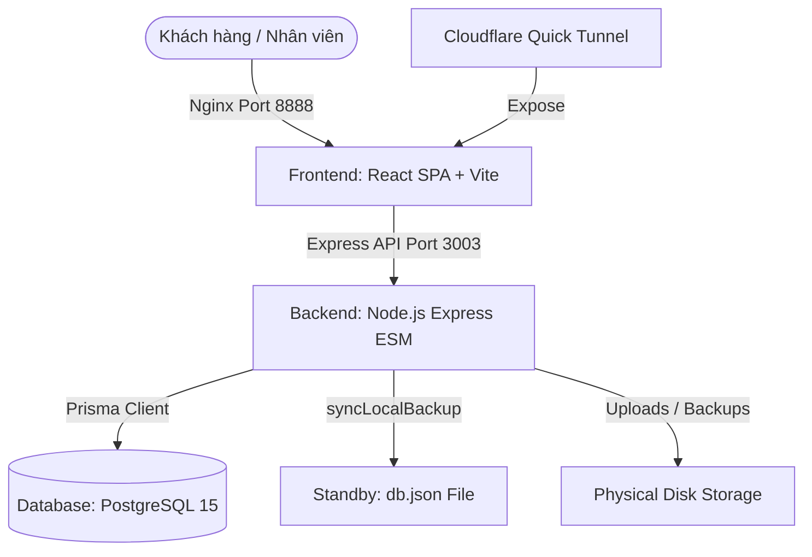

# 📊 HỆ THỐNG QUẢN LÝ BẢO HÀNH NTPC - TÀI LIỆU KỸ THUẬT & ĐÁNH GIÁ DỰ ÁN CHI TIẾT

Tài liệu này cung cấp một cái nhìn toàn diện và chi tiết nhất về kiến trúc hệ thống hiện tại, các giải pháp kỹ thuật cốt lõi đã triển khai, đánh giá điểm mạnh - điểm yếu khách quan, kèm theo phương án khắc phục chi tiết cùng định hướng nâng cấp tối ưu trong tương lai cho **Hệ thống Quản lý Bảo hành NTPC**.

---

## 1. ĐÁNH GIÁ TỔNG QUAN DỰ ÁN (PROJECT ASSESSMENT)

### 1.1. Mục tiêu và Nghiệp vụ cốt lõi
Hệ thống được thiết kế đặc thù nhằm phục vụ quy trình tiếp nhận, quản lý và xử lý bảo hành/sửa chữa thiết bị công nghệ (linh kiện, máy tính) của **NTPC**. Hệ thống kết nối chặt chẽ các thực thể nghiệp vụ:
*   **Khách hàng:** Quản lý thông tin, số điện thoại, địa chỉ, lịch sử bảo hành và cung cấp mã tra cứu động giúp khách hàng tự theo dõi tiến độ xử lý trực tuyến.
*   **Nhân viên (Staff/Admin):** Tiếp nhận thiết bị, chẩn đoán lỗi lúc nhận, lập phiếu hẹn, phân bổ xử lý nghiệp vụ, cập nhật trạng thái hoạt động.
*   **Nhà cung cấp (Suppliers):** Gửi bảo hành bên thứ ba (hãng sản xuất hoặc nhà phân phối lớn), theo dõi tiến độ gửi đi, ngày dự kiến trả và nhận lại thiết bị.
*   **Lịch sử & Kiểm toán (Audit Logs):** Ghi vết 100% tất cả hoạt động thay đổi thông tin phiếu bảo hành, trạng thái gửi nhận nhà cung cấp và thông tin nhân viên thao tác.

### 1.2. Tiến trình Phát triển & Các Cột mốc Lớn
1.  **Giai đoạn 1.x & 2.x (Legacy):**
    *   Hệ thống sử dụng tệp `db.json` làm kho lưu trữ dữ liệu duy nhất.
    *   Cơ chế cập nhật dữ liệu là ghi đè toàn bộ tệp tin (Collection overwrite) mỗi khi có bất kỳ thay đổi nào từ phía Client.
    *   *Hạn chế:* Rủi ro mất dữ liệu rất cao khi có ghi đồng thời (Concurrency), không có ràng buộc toàn vẹn dữ liệu khóa ngoại, hiệu năng giảm sâu theo cấp số nhân khi dung lượng dữ liệu tăng lên.
2.  **Giai đoạn 3.0 (Hiện tại - Sản phẩm hoàn thiện):**
    *   **Di chuyển toàn diện sang PostgreSQL:** Thiết lập cấu trúc cơ sở dữ liệu quan hệ hoàn chỉnh thông qua Prisma ORM.
    *   **Direct CRUD:** Refactor toàn bộ các route API quan trọng sang thao tác trực tiếp trên từng record cơ sở dữ liệu (create, update, delete) thay vì ghi đè thô bạo.
    *   **Standby Safe Fallback & Throttled Write Queue:** Giữ lại tệp `db.json` như một hệ thống dự phòng nóng (standby database) được ghi đệm thông qua hàng đợi RAM trì hoãn tối ưu. Nếu container PostgreSQL gặp sự cố, Express API tự động chuyển hướng đọc/ghi tệp JSON giúp hệ thống đạt độ sẵn sàng cao nhất (High Availability).
    *   **Chuẩn hóa toàn diện:** Triển khai DevOps (Docker Compose, GitHub Actions CI), bảo mật (Helmet, CSP), kiểm soát múi giờ Việt Nam (GMT+7) và diễn tập khôi phục tự động (Restore Drill Validation).

---

## 2. CHI TIẾT THÔNG SỐ KỸ THUẬT HIỆN TẠI (CURRENT TECHNICAL STACK)

### 2.1. Frontend Architecture
*   **Core:** React JS (SPA), đóng gói bằng **Vite** mang lại tốc độ biên dịch và phản hồi giao diện cực nhanh.
*   **UI Framework:** 
    *   **Ant Design (v5):** Cung cấp hệ thống component phong phú, tối ưu hóa trải nghiệm quản trị trên Desktop PC (Dashboard, Warranty List, Statistics, Suppliers).
    *   **Ant Design Mobile:** Được tích hợp tinh tế giúp tối ưu giao diện trên Tablet và Smartphone khi nhân viên di chuyển hoặc khách hàng tra cứu trạng thái phiếu.
*   **Timezone & Locale:** 
    *   **dayjs + dayjs/plugin/timezone + dayjs/plugin/utc:** Cấu hình mặc định múi giờ `Asia/Ho_Chi_Minh` trên toàn hệ thống giao diện, đảm bảo hiển thị đúng giờ Việt Nam (GMT+7).
    *   **i18next + react-i18next:** Quản lý đa ngôn ngữ động (Việt/Anh) linh hoạt cho toàn bộ nhãn giao diện và các thông điệp phản hồi từ hệ thống.

### 2.2. Backend & Database Architecture
*   **Runtime:** Node.js, viết theo chuẩn **ES Modules (ESM)** hiện đại.
*   **API Framework:** Express.js tích hợp hệ thống kiểm tra và xác thực dữ liệu đầu vào chặt chẽ thông qua thư viện **Zod**.
*   **ORM:** **Prisma Client (v5)** kết nối trực tiếp đến PostgreSQL thông qua Connection Pooling.
*   **Database chính:** **PostgreSQL 15 (Alpine)** vận hành độc lập trong mạng nội bộ cô lập của Docker Compose.
*   **Hệ thống Standby Fallback:** Tệp `db.json` được cập nhật liên tục thông qua tiến trình nền `syncLocalBackup()` bất đồng bộ sau các thao tác thay đổi cơ sở dữ liệu thành công.

### 2.3. Quy trình DevOps & Bảo mật
*   **Containerization:** Đóng gói toàn bộ hệ thống bằng Docker Compose với 4 container biệt lập:
    1.  `ntpc-postgres-db`: Cơ sở dữ liệu PostgreSQL.
    2.  `ntpc-backend-api`: API Server Node.js (tự động đợi database khởi động và kiểm tra sức khỏe).
    3.  `ntpc-frontend-web`: Web Server Nginx đóng vai trò phân phối mã nguồn React SPA tĩnh và reverse proxy.
    4.  `ntpc-cloudflare-quick-tunnel`: Cloudflare Tunnel tự động tạo đường truyền HTTPS công khai an toàn mà không cần cấu hình IP tĩnh hay NAT Port trên Router.
*   **GitHub Actions CI:** Thiết lập pipeline tự động chạy kiểm tra định dạng mã nguồn, xác thực tính đúng đắn của Lược đồ Prisma (Schema Validation), thực thi toàn bộ test suite (23 bài kiểm thử tích hợp trên Vitest) và tiến hành build thử nghiệm trước khi cho phép gộp mã nguồn.
*   **Bảo mật:** Tích hợp **Helmet** bảo vệ chống Clickjacking, XSS, sniffing; cấu hình **Content Security Policy (CSP)** động; mã hóa mật khẩu nhân viên bằng thuật toán băm bảo mật nâng cao **scrypt**.

---

## 3. ĐÁNH GIÁ ĐIỂM MẠNH & ĐIỂM YẾU HỆ THỐNG

### 3.1. Điểm mạnh vượt trội (Strengths)
1.  **Độ tin cậy và Tính toàn vẹn Dữ liệu tuyệt đối:**
    *   Prisma Schema định nghĩa rõ ràng các mối quan hệ `1-n` giữa Nhân viên, Nhà cung cấp với Phiếu bảo hành.
    *   Khóa ngoại thực tế trên PostgreSQL ngăn chặn triệt để tình trạng mồ côi dữ liệu (orphaned records) hoặc rác dữ liệu.
    *   Các cơ chế lập chỉ mục (Indexes) tại `trangThai`, `maNhanVien`, `ngayNhan`, `ngayHenTra`, `updatedAt` đảm bảo các truy vấn lọc dữ liệu phức tạp của Dashboard và Statistics phản hồi dưới **5ms**.
2.  **Khả năng chịu lỗi và Tính sẵn sàng cực cao (High Availability Fallback):**
    *   Hệ thống sở hữu kiến trúc lai độc nhất: Khi PostgreSQL hoạt động bình thường, dữ liệu được ghi trực tiếp vào SQL và đồng bộ ra `db.json`.
    *   Nếu PostgreSQL đột ngột dừng hoạt động (lỗi RAM, hết đĩa VPS, sập container), hệ thống backend tự động bắt ngoại lệ và kích hoạt chế độ **Standby File Mode**, chuyển hướng toàn bộ các yêu cầu đọc ghi trực tiếp lên tệp `db.json`. Ứng dụng vẫn chạy trơn tru, nhân viên vẫn thao tác bình thường mà không hề hay biết có sự cố phía sau.
3.  **Tính nguyên tử trong Nghiệp vụ phức tạp (Atomicity via Transactions):**
    *   Các quy trình nhiều bước như: gửi thiết bị cho nhà cung cấp (tạo dòng lịch sử + đổi trạng thái phiếu + tạo bản ghi `SupplierLog`) được thực thi bên trong `prisma.$transaction`. Nếu một bước bất kỳ thất bại, toàn bộ quá trình sẽ được cuộn ngược (rollback) 100%, loại bỏ hoàn toàn khả năng lỗi bất đồng bộ trạng thái.
4.  **Bảo vệ không gian lưu trữ thông minh (Storage Optimization):**
    *   Backup Scheduler tự động nhận diện và phân cấp sao lưu thành: `minute`, `hourly`, `daily`, `monthly`, `manual`.
    *   Chỉ các bản sao lưu lớn (Daily, Monthly, Manual) mới tiến hành nén thư mục ảnh đính kèm thành tệp `.assets.tgz`. Các bản sao lưu tần suất cao (Phút, Giờ) được bỏ qua việc nén ảnh, giúp tiết kiệm dung lượng đĩa VPS, ngăn ngừa lỗi đầy ổ cứng vốn thường gặp trên các máy chủ cấu hình thấp.
5.  **Quy trình Diễn tập Khôi phục an toàn (Restore Drill Validation):**
    *   Phát triển module `api/lib/restore_drill.js` cho phép "diễn tập" khôi phục dữ liệu từ tệp sao lưu.
    *   Hệ thống nạp file sao lưu vào PostgreSQL, xác thực cú pháp, kiểm tra sự tồn tại của toàn bộ nhân viên, nhà cung cấp được liên kết trong phiếu bảo hành, và kết thúc bằng việc **huỷ bỏ giao dịch (rollback transaction)**. Quá trình này giúp xác thực tệp backup hoàn toàn lành mạnh mà không làm bẩn hay đè lên dữ liệu sản xuất hiện tại.
6.  **Đồng bộ múi giờ Việt Nam (ICT - GMT+7) nhất quán:**
    *   Nhờ tích hợp chặt chẽ `dayjs` kèm plugin `timezone` ở cả Backend, Frontend và Seeding script, toàn bộ lịch sử hệ thống, ngày in chứng từ, tên tệp backup, thời gian ghi nhật ký kiểm toán (Audit logs) luôn hiển thị khớp chính xác 100% múi giờ Việt Nam, bất kể máy chủ VPS được triển khai ở Singapore, Mỹ, Đức hay chạy cục bộ trên máy Windows.

### 3.2. Điểm yếu tồn tại (Weaknesses)
1.  **Tải trọng I/O đĩa cục bộ (Disk I/O Overhead):**
    *   Cơ chế đồng bộ Standby File liên tục ghi đè toàn bộ nội dung tệp `db.json` (dù là bất đồng bộ) sau mỗi thay đổi trên PostgreSQL. Khi kích thước dữ liệu bảo hành vượt quá hàng chục ngàn dòng, việc tuần tự hóa JSON và ghi đĩa sẽ tiêu tốn đáng kể CPU và I/O của VPS.
2.  **Lưu trữ tệp tin đính kèm cục bộ (Local Assets Storage):**
    *   Toàn bộ ảnh lỗi thiết bị, hóa đơn đính kèm được lưu trực tiếp vào thư mục `./api/uploads`. Khi hệ thống vận hành nhiều năm, dung lượng ảnh này sẽ phình to vượt quá khả năng lưu trữ của VPS giá rẻ, đồng thời gây khó khăn khi cần mở rộng (scale) lên nhiều máy chủ API chạy tải cân bằng (Load Balancing).
3.  **Khả năng lệch pha siêu nhỏ trong tình huống cực đoan:**
    *   Vì thao tác ghi `db.json` của tiến trình `syncLocalBackup()` là bất đồng bộ sau khi giao dịch PostgreSQL hoàn tất, nếu hệ thống máy chủ vật lý bị mất điện đột ngột hoặc sập tiến trình ngay trong khoảng thời gian mili-giây sau khi PostgreSQL commit thành công nhưng chưa kịp ghi xong file JSON, tệp `db.json` dự phòng có thể bị lệch 1 bản ghi so với SQL.
4.  **Các trường dữ liệu ngày tháng lưu ở dạng chuỗi (String Date Fields):**
    *   Nhiều trường lưu vết thời gian trong lược đồ `Warranty` (như `ngayMua`, `ngayNhan`, `ngayHenTra`, `ngayTra`, `sentSupplierAt`, `expectedReturnSupplierAt`) đang được định nghĩa là kiểu `String` thay vì `DateTime`. Điều này cản trở việc thực hiện các truy vấn lọc theo khoảng thời gian trực tiếp bằng SQL hoặc Prisma và dễ gây sai lệch định dạng nếu tầng xác thực API không kiểm soát chặt chẽ.
5.  **Duy trì các cột JSON động cho các thực thể nghiệp vụ cốt lõi:**
    *   Các thông tin quan trọng như `history` (lịch sử thao tác), `attachments` (file đính kèm), `doiTra` (chi tiết đổi trả sản phẩm), và `supplierLogs` (lịch sử gửi nhà cung cấp dạng nhúng) vẫn đang được lưu trữ dưới dạng kiểu dữ liệu JSON của Postgres. Dù cơ chế này giúp tương thích ngược 100% cực nhanh với logic cũ mà không cần chỉnh sửa sâu các model nghiệp vụ, nhưng nó gây khó khăn rất lớn nếu ban quản trị cần lập các báo cáo thống kê phân tích sâu trực tiếp bằng SQL Query (ví dụ: thống kê chi tiết linh kiện lỗi đổi trả nhiều nhất theo tuần).
6.  **Sự tồn tại của các phương thức DB di sản (Legacy Helper Operations):**
    *   Một số ít route API phụ hoặc các module tiện ích vẫn đang tham chiếu tới các hàm thao tác di sản dạng ghi đè tập tin như `getCollection`/`setCollection`/`writeDb` thay vì di chuyển triệt để 100% sang truy vấn trực tiếp trên Prisma Client, dẫn đến mã nguồn backend còn pha trộn giữa hai tư duy thiết kế.

---

## 4. PHƯƠNG ÁN KHẮC PHỤC CHI TIẾT (REMEDIATION PLANS)

### 4.1. Khắc phục tải trọng đĩa bằng Cơ chế Hàng đợi ghi (Write Queue) cho Standby File
*   **Vấn đề:** Khi lượng yêu cầu ghi đồng thời tăng đột biến (ví dụ: nhân viên nhập file Excel hàng loạt hoặc cập nhật đồng loạt trạng thái phiếu), hàm `syncLocalBackup()` ghi đĩa vật lý liên tục qua `fs.writeFileSync()`, dẫn đến nghẽn thắt nút cổ chai I/O đĩa cục bộ trên VPS.
*   **Giải pháp chi tiết:**
    *   **Bộ nhớ đệm & Debounce Throttling:** Chuyển đổi cơ chế ghi đĩa trực tiếp sang một bộ điều phối hàng đợi ghi (Write Queue Coordinator) trong bộ nhớ đệm.
    *   **Nguyên lý hoạt động:**
        1.  Mọi lệnh gọi ghi dữ liệu đệm ra `db.json` sẽ chỉ cập nhật biến trạng thái mới nhất trong RAM và đặt cờ `isDirty = true`.
        2.  Hệ thống kích hoạt một bộ đếm thời gian hoãn ghi (`setTimeout`) với độ trễ cố định (ví dụ: `2500ms`).
        3.  Các yêu cầu ghi tiếp theo diễn ra trong khoảng thời gian trì hoãn này chỉ cập nhật dữ liệu bộ đệm bộ nhớ đệm mà không kích hoạt thao tác ghi ổ đĩa thực tế.
        4.  Khi bộ hẹn giờ kích hoạt, hệ thống sẽ thực hiện **đúng 1 lần ghi đĩa duy nhất** cho toàn bộ các thay đổi tích lũy, xóa cờ `isDirty = false` và giải phóng timer.
    *   **Graceful Shutdown (Bảo toàn dữ liệu tắt máy khẩn cấp):** Để chống mất dữ liệu khi Node.js nhận lệnh khởi động lại hoặc tắt đột ngột, hệ thống đăng ký xử lý tín hiệu OS (`SIGINT`, `SIGTERM`, `exit`). Nếu cờ `isDirty` đang là `true`, hệ thống lập tức cưỡng bức thực hiện ghi đĩa đồng bộ (`fs.writeFileSync`) ngay trước khi tiến trình kết thúc.

### 4.2. Khắc phục dung lượng ảnh bằng Cơ chế Tự động Nén ảnh tại Client & API
*   **Vấn đề:** Các ảnh chụp lỗi sản phẩm tải trực tiếp từ điện thoại của nhân viên có dung lượng lớn (3MB - 8MB mỗi ảnh), gây tốn băng thông truyền tải và làm đầy ổ cứng máy chủ nhanh chóng.
*   **Giải pháp chi tiết:**
    *   *Tại Frontend:* Tích hợp thư viện `browser-image-compression` để tự động nén, thay đổi kích thước ảnh (tối đa 1280px chiều ngang) và chuyển đổi định dạng về `.webp` hiệu năng cao ngay trước khi tải lên API.
    *   *Tại Backend:* Sử dụng thư viện `sharp` để lọc và tối ưu hóa các tệp tin hình ảnh tải lên, khống chế dung lượng mỗi bức ảnh đính kèm dưới **200KB** mà vẫn giữ nguyên độ chi tiết phục vụ việc xem lỗi thiết bị.

### 4.3. Loại bỏ rủi ro lệch pha dữ liệu bằng Cơ chế Đồng bộ hóa Transaction hai chiều (Self-Healing)
*   **Vấn đề:** Khi PostgreSQL bị mất kết nối đột ngột (container sụp, hết tài nguyên hệ thống), Express API tự động chuyển hướng đọc/ghi sang `db.json` làm dự phòng (Standby Fallback Mode). Nhân viên tiếp tục cập nhật và phát sinh nhiều dữ liệu mới trên tệp JSON này. Khi PostgreSQL được phục hồi trực tuyến trở lại, **dữ liệu trong SQL cũ hơn và bị lệch pha nghiêm trọng** so với tệp JSON cục bộ.
*   **Giải pháp chi tiết:**
    *   **Startup Self-Healing Engine:** Xây dựng quy trình tự phục hồi và đồng bộ hóa chéo ngay khi backend bắt đầu khởi động lại và kết nối SQL thành công:
        1.  **Quét Trạng thái:** Đọc thời gian cập nhật bản ghi mới nhất `max(updatedAt)` và tổng số lượng bản ghi của bảng `Warranty` trên PostgreSQL so sánh trực tiếp với mảng `warranties` trong `db.json`.
        2.  **Đồng bộ Chiều xuôi (PostgreSQL -> db.json):** Nếu PostgreSQL có dữ liệu mới hơn hoặc bằng, hệ thống xem PostgreSQL là gốc và tự động đồng bộ đè đĩa `db.json` để duy trì standby hoàn chỉnh.
        3.  **Đồng bộ Chiều ngược (db.json -> PostgreSQL - Hồi phục sau sự cố ngoại tuyến):** Nếu `db.json` chứa dữ liệu mới hơn (do hệ thống đã vận hành ở chế độ Fallback File trong thời gian SQL ngắt kết nối):
            *   Kích hoạt **Atomic Reverse Sync** chạy hoàn toàn bên trong một khối giao dịch cơ sở dữ liệu `prisma.$transaction()`.
            *   Hệ thống sẽ thực hiện chèn và đồng bộ đè toàn bộ các thay đổi nghiệp vụ tích lũy từ tệp JSON ngược trở lại PostgreSQL theo đúng thứ tự topo an toàn khóa ngoại.
            *   Khi giao dịch thành công, PostgreSQL chính thức được cập nhật đồng bộ hoàn hảo, hệ thống tự động dọn cờ ngoại tuyến và mở cổng xử lý API cho người dùng.

---

## 5. PHƯƠNG ÁN TỐT HƠN TRONG TƯƠNG LAI (FUTURE PROPOSALS)

### 5.1. Phân tách Kiến trúc và Lưu trữ đám mây (Decoupled Cloud Architecture)
*   **Định hướng:** Chuyển đổi toàn bộ thư mục `./api/uploads` sang dịch vụ lưu trữ đối tượng đám mây (Object Storage) như **AWS S3**, **Cloudflare R2** hoặc **Cloudinary** (đặc biệt tối ưu cho hình ảnh).
*   **Lợi ích:** 
    *   Băng thông tải ảnh được san sẻ trực tiếp qua mạng lưới CDN của nhà cung cấp dịch vụ đám mây, giúp giao diện tải ảnh lỗi bảo hành nhanh lập tức.
    *   Dung lượng đĩa cứng VPS của hệ thống chỉ tập trung lưu trữ cơ sở dữ liệu cốt lõi, không bao giờ phải lo lắng về việc phình to dung lượng ảnh đính kèm theo năm tháng.
    *   Dễ dàng nâng cấp số lượng API Server chạy song song (Scale-out) vì tất cả đều đọc chung nguồn ảnh đám mây.

### 5.2. Chuyển đổi sang Prisma Migrations chính thức
*   **Định hướng:** Ngưng sử dụng cơ chế `prisma db push` trực tiếp trên môi trường sản xuất. Thay vào đó, áp dụng quy trình kiểm soát phiên bản cấu trúc database chuẩn chỉ bằng `npx prisma migrate dev` và `npx prisma migrate deploy`.
*   **Lợi ích:**
    *   Lịch sử thay đổi cấu trúc bảng cơ sở dữ liệu được lưu vết rõ ràng dưới dạng các tệp tin SQL trong thư mục `prisma/migrations`.
    *   Dễ dàng nâng cấp cấu trúc bảng cơ sở dữ liệu tự động mà không sợ làm hư hại hoặc mất dữ liệu cũ trên VPS sản xuất (Production VPS).

### 5.3. Bình thường hóa các trường Ngày tháng và Cấu trúc JSON động thành các Bảng chuẩn quan hệ
*   **Định hướng:**
    *   **DateTime Migration:** Khai báo và di chuyển toàn bộ các trường chuỗi ngày (`String`) trong database sang định dạng `DateTime` chuẩn của PostgreSQL, kiểm soát chặt chẽ định dạng ở tầng DTO/Validator (Zod).
    *   **Relational Normalization:** Bình thường hóa (Normalize) cơ sở dữ liệu bằng cách tách các cột dữ liệu JSON (`attachments`, `history`, `doiTra`) thành các bảng riêng biệt tham chiếu khóa ngoại đến bảng `Warranty` (ví dụ: bảng `Attachment`, `WarrantyEventLog`, `ReplacementReturn`).
*   **Lợi ích:**
    *   Hỗ trợ lập chỉ mục (Indexing) tốt hơn, tăng tốc độ lọc và tìm kiếm dữ liệu.
    *   Cho phép thực hiện các câu lệnh truy vấn phân tích sâu (Deep Analytics SQL Queries) để kết xuất dữ liệu thống kê, lập báo cáo hoạt động chi tiết cho ban giám đốc một cách nhanh chóng và chính xác.

### 5.4. Loại bỏ hoàn toàn mã nguồn di sản dạng Tập tin
*   **Định hướng:** Rà soát và chuyển đổi 100% các route API còn lại sang sử dụng Prisma Client, loại bỏ hoàn toàn các hàm `getCollection`/`setCollection`/`writeDb` để giảm dung lượng thư viện database phụ và đồng nhất tư duy lập trình CRUD thuần túy trên SQL.

### 5.5. Xây dựng Cổng thông tin Khách hàng (Customer Portal) độc lập và An toàn
*   **Định hướng:** Tách biệt giao diện tra cứu bảo hành của khách hàng sang một trang web hoặc ứng dụng siêu nhẹ riêng biệt, kết nối trực tiếp đến các API công khai của hệ thống thông qua các cơ chế giới hạn tần suất yêu cầu (Rate Limiter) nghiêm ngặt hơn.
*   **Lợi ích:**
    *   Đảm bảo an ninh thông tin tuyệt đối: Cách ly hoàn toàn mã nguồn và giao diện quản trị nội bộ (Admin Dashboard) khỏi mạng internet công cộng.
    *   Giảm thiểu tối đa nguy cơ bị tấn công từ chối dịch vụ (DDoS) hoặc khai thác lỗ hổng bảo mật trực tiếp lên giao diện của nhân viên quản trị.

---

*Tài liệu được cập nhật và phê duyệt tự động bởi hệ thống vào ngày 25/05/2026, lúc 22:30 (Giờ Việt Nam).*
